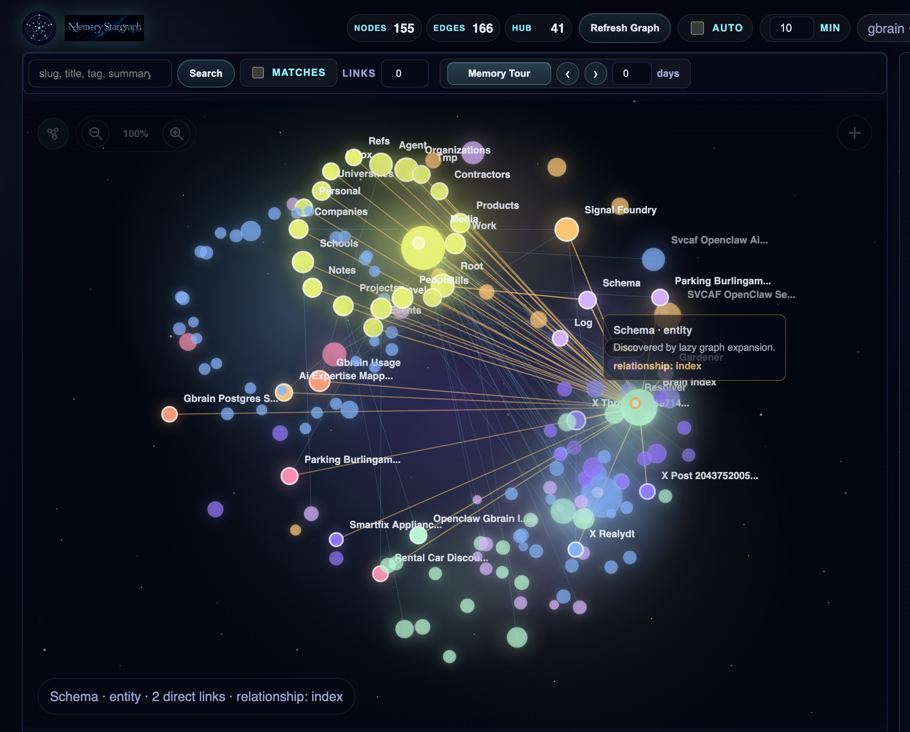
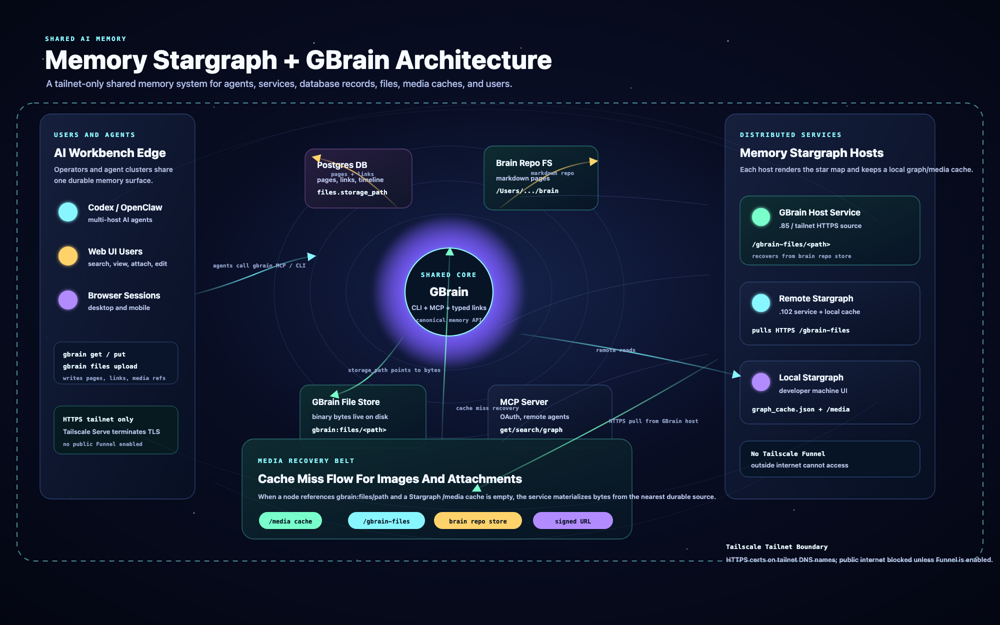

# Memory Stargraph

<p align="center">
  
</p>

<p align="center">
  
</p>

Memory Stargraph is a local web service for exploring a `gbrain` knowledge base as an interactive star-cloud entity graph.

It is built with Python stdlib plus vanilla HTML/CSS/Canvas JavaScript, so it runs without `npm install`.

## Showcase

### Interactive Stargraph

<p align="center">
  
</p>

### Shared AI Memory Architecture

<p align="center">
  
</p>

[Watch the demo video on YouTube](https://youtu.be/GbWZo7g1ZBA)

## Run

```bash
python3 server.py
```

Optional:

```bash
python3 server.py --host 127.0.0.1 --port 8788
```

Open:

```text
http://127.0.0.1:8788
```

## Main Features

These are the highest-value features for understanding, maintaining, and extending a `gbrain` knowledge base.

1. **Entity graph exploration** - Search by slug, title, tag, or summary, then click any node to lazily load its direct gbrain neighbors.
2. **Relationship visibility** - Hover or tap directly linked nodes to see the entity summary and relationship type in a mouse-near popup.
3. **Read-only knowledge viewing** - Open `View` to render the node's gbrain markdown with entity links and media references resolved for browsing.
4. **Ask GBrain** - Ask contextual questions in a chat-style panel backed by the selected node, graph context, media hints, and targeted gbrain retrieval.
5. **Graph query from here** - Run guided typed/directional traversals from the selected node without writing raw graph commands.
6. **Relationship editing** - Add relationships by searching/selecting target nodes and link types, or remove only existing relationships.
7. **Timeline viewing and event capture** - Read a node timeline as rendered markdown and add structured timeline events with date, summary, detail, and source.
8. **Media attachment and preview** - Attach local files through the browser, write markdown references back to gbrain, and preview supported media through configured media roots or trusted remote media endpoints.
9. **Freshness and source status** - Refresh live gbrain data, enable timed auto-refresh, and inspect source/cache status in the `Graph source` panel.
10. **Noise reduction for large brains** - Keep the root `index` eagerly loaded, collapse dated report/document-part nodes, humanize path labels, hide UI-only nodes, filter by matches/minimum links, and use selection history to move through visited nodes.

## GBrain Integration

Default backend path:

```text
/opt/homebrew/bin/gbrain
```

### GBrain Setup Requirements

Memory Stargraph works best when `gbrain` is already initialized and healthy on the machine running the web service. Before launching the service, verify:

- `gbrain` is installed and runnable from the service process. If it is installed through a user-local runtime, add that runtime's `bin` directory to `PATH` or set `"gbrain_path"` in `config/local.json`.
- The host has a valid gbrain configuration. A storage host should have a normal local database configuration; a client-only machine should have a working `remote_mcp` configuration and pass `gbrain remote doctor`.
- Basic read commands work: `gbrain list`, `gbrain get <slug>`, `gbrain graph <slug> --depth 1`, `gbrain backlinks <slug>`, and `gbrain search <query>`.
- Mutation commands you plan to expose from the UI work in your topology: `put`, `link`, `unlink`, `tag`, `untag`, `timeline-add`, `files upload`, and `delete`.
- Media files referenced by gbrain pages are reachable from the web service. Use local `media_roots` when the files are on the same host, or configure `remote_media_base_urls` when the web service is on a different host.
- The root `index` page exists and is useful, because Memory Stargraph expands it eagerly to give the graph a meaningful starting structure.

For multi-machine setups, run the service on each web host with its own `config/local.json`. Keep runtime state local, keep secrets out of the repo, and verify `/api/health` plus one known entity search after every deployment.

Upstream GBrain note: for remote-MCP installations with multiple clients, see the submitted GBrain PR [garrytan/gbrain#2501](https://github.com/garrytan/gbrain/pull/2501), which makes the OAuth token rate limit configurable. That helps avoid noisy refresh failures when several agents or web services share the same GBrain host.

Load strategy:

1. `gbrain list -n 140`
2. Eager root expansion with `gbrain graph index --depth 1` and `gbrain backlinks index`
3. Lazy node expansion with `gbrain graph <slug> --depth 1` and `gbrain backlinks <slug>`
4. Search enrichment with `gbrain search <query>`
5. Raw details with `gbrain get <slug>` on demand

If live gbrain access fails, the service:

1. Tries `data/graph_cache.json` from the last successful load.
2. Falls back to bundled demo data.
3. Surfaces cache/demo/error status in the UI.

## Local Configuration

Committed example:

```text
config/local.example.json
```

Local override, ignored by Git:

```text
config/local.json
```

Supported config keys include host, port, public directory, data directory, gbrain path, list count, graph depth, cache staleness, command limit, and command pause.

Runtime state is local-only:

```text
data/graph_cache.json
data/hidden_entities.json
data/deleted_entities.json
```

Deployment notes:

- Keep `config/local.json` uncommitted and machine-specific.
- For LAN or remote access, set `"host": "0.0.0.0"` in `config/local.json` or pass `--host 0.0.0.0`.
- Set `"gbrain_path"` to the absolute `gbrain` binary path on the target machine.
- If `gbrain` is installed in a user-local package manager path, export that path before starting or testing the service.
- If the web host is not the media storage host, set `"remote_media_base_urls"` to a trusted media endpoint on the storage host.
- Keep media roots local to the target machine and avoid committing uploaded media or runtime cache files.

## AI Agent Setup Prompt

Use this prompt when asking an AI coding agent to set up, verify, or continue Memory Stargraph:

```text
You are working on Memory Stargraph from a clean clone of `git@github.com:techtony2018/memory-stargraph.git`.

Goal:
- Set up and verify the local Memory Stargraph web service for a gbrain entity graph.
- Keep local runtime state separate from public repo files.
- Do not commit `data/*.json`, `config/local.json`, `.DS_Store`, caches, screenshots, or private `.project/` notes.

Repository and public layout:
- Public repo target: `git@github.com:techtony2018/memory-stargraph.git`
- Python service: `server.py`
- Public web files: `public/index.html`, `public/styles.css`, `public/app.js`
- Config example: `config/local.example.json`
- Local override: `config/local.json` (ignored by Git)
- Runtime state: `data/graph_cache.json`, `data/hidden_entities.json`, `data/deleted_entities.json` (ignored by Git)

Expected local service:
- URL: `http://127.0.0.1:8788`
- Health check: `curl -sS http://127.0.0.1:8788/api/health`
- Default gbrain path: `/opt/homebrew/bin/gbrain`
- On other machines, set `"gbrain_path"` to the installed gbrain binary, set `"host": "0.0.0.0"` only when remote access is intended, set `"remote_media_base_urls"` when media lives on another host, and export any required package-manager paths before starting the service.

Setup steps:
1. Inspect `git status --short` and do not revert unrelated user changes.
2. If needed, copy `config/local.example.json` to `config/local.json` and adjust only local machine values.
3. On remote or shared machines, set `config/local.json` to use the target machine's `"gbrain_path"` and a `media_roots` entry for any local gbrain image folder. If media is stored on a different host, add that host's `/media/` endpoint to `"remote_media_base_urls"`.
4. Start the service with `python3 server.py --host 127.0.0.1 --port 8788`.
5. Open `http://127.0.0.1:8788` and verify the graph loads.
6. Search for a known entity in your gbrain, select it, hover a direct neighbor, and confirm the mouse-near popup shows the relationship type.
7. Confirm `View` is the first node menu item and all node operations render.

HTTPS options:
- For Tailscale access, prefer keeping Memory Stargraph on local HTTP and putting Tailscale Serve in front of it:

```bash
python3 server.py --host 127.0.0.1 --port 8788
tailscale serve --https=443 http://127.0.0.1:8788
```

Then open `https://<machine>.<tailnet>.ts.net/`.

- If you already have a certificate and key, Memory Stargraph can serve HTTPS directly:

```bash
python3 server.py --host 0.0.0.0 --port 8788 --certfile /path/fullchain.pem --keyfile /path/privkey.pem
```

Direct TLS on port `8788` will use `https://<host>:8788/`; Tailscale Serve is usually cleaner because it manages the trusted tailnet certificate.

Verification commands:
- export PATH="$HOME/.bun/bin:/usr/local/bin:/opt/homebrew/bin:$PATH"
- python3 -m py_compile server.py
- python3 -m unittest discover -s tests
- node --check public/app.js
- node --check tests/browser_smoke.mjs
- node tests/browser_smoke.mjs
- If Playwright is not locally resolvable, use `npx --yes --package playwright node tests/browser_smoke.mjs`.

Supported node operations to preserve:
1. View
2. Timeline
3. Ask GBrain
4. View media
5. Graph query from here
6. Add relationship
7. Remove relationship
8. Show backlinks
9. Attach file
10. Delete from gbrain

Behavior requirements:
- Root `index` should always load eagerly.
- Search should be explicit via Return or the Search button.
- Refresh Graph should disable while active.
- Hidden nodes are UI-only and persistent in the local backend.
- Relationships should be visible on graph hover in the 60% opacity mouse-near popup.
- Direct-neighbor labels should be visible when a node is selected.
- Path-style labels should be humanized, e.g. `companies/uber` to `Uber`.
- Aggregated part/report nodes should stay collapsed.

Safety:
- `Hide` is UI-only.
- `Delete from gbrain`, markdown edits, relationship edits, timeline events, and file attachments modify gbrain.
- Do not push until the verification commands pass and the browser smoke has been run or a specific blocker is reported.
```

## Project Layout

- `server.py` - Python stdlib web service and gbrain command adapter
- `public/index.html` - app shell
- `public/styles.css` - visual system and responsive layout
- `public/app.js` - graph rendering, interactions, and node operations
- `tests/test_graph_parsing.py` - backend parser and command-construction tests
- `tests/browser_smoke.mjs` - Playwright end-to-end smoke test
- `dashboard-integration.json` - All Things Codex Dashboard launcher metadata

## Verification

```bash
python3 -m py_compile server.py
python3 -m unittest discover -s tests
node --check public/app.js
node --check tests/browser_smoke.mjs
node tests/browser_smoke.mjs
```

Useful live checks:

```bash
curl -sS http://127.0.0.1:8788/api/health
curl -sS http://127.0.0.1:8788/api/graph
```

## License

Memory Stargraph is released under the MIT License. See [LICENSE](LICENSE).
